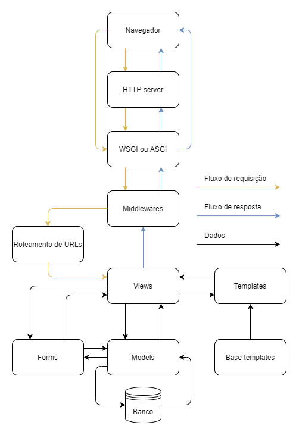

# Django

> Texto em construção.

O Django é um framework Python para construção de sites dinâmicos.

Ele utiliza o padrão/arquitetura **MTV** (Model Template View), o **conceito** é exatamente o mesmo do **MVC** (Model View Controller), a diferença é que no Django:
 
 - Não temos um arquivo chamado **Controller**, essa responsabilidade fica a cargo do arquivo **View**.
 - No MVC o código HTML fica no arquivo **View** no Django esse código fica no **Template**.
 
 Durante a faculdade fiz o seguinte diagrama durante o desenvolvimento de um projeto utilizando Django:
 


> **OBS**: Este é um diagrama que fiz para tentar entender o fluxo dos dados no Django, o mesmo pode não estar completo ou totalmente correto, fiz apenas para fins de estudo.

## Ajax

Algumas formas de pegar o CSRF token com javascript.

Via meta tag:

```js
<meta name="csrftoken" content="{{ csrf_token }}">

var token = document.querySelector('meta[name="csrftoken"]').getAttribute('content')
console.log(token)
```

Via jQuery:

```js
var csrftoken = jQuery("[name=csrfmiddlewaretoken]").val()
console.log(csrftoken)
```

Via JS Cookie (https://github.com/js-cookie/js-cookie/):

```js
var csrftoken = Cookies.get('csrftoken')
console.log(csrftoken)
``` 

Via função (Site do Djnago):
```js
function get_cookie(name) {
  var cookieValue = null;
  if (document.cookie && document.cookie !== '') {
    var cookies = document.cookie.split(';');
    for (var i = 0; i < cookies.length; i++) {
      var cookie = cookies[i].trim();
      // Does this cookie string begin with the name we want?
      if (cookie.substring(0, name.length + 1) === (name + '=')) {
        cookieValue = decodeURIComponent(cookie.substring(name.length + 1));
        break;
      }
    }
  }
  return cookieValue;
}

// Executando a função que foi criada:
var csrftoken = get_cookie('csrftoken')
console.log(csrftoken)
```

## Heroku

Este projeto está hospedado e funcionando no Heroku:

[]()

Como este repositório é apenas um exemplo:

- O DEBUG está como True.
- A SECRET_KEY está em hardcode.
- A parte de media e arquivos estáticos não está configurada da melhor forma.

> **OBS**: 🚨 Não faça nada disso em produção! 🚨

Enviando o código para o Heroku:

```bash
git push heroku master
```

Gerando as migrações:

```bash
heroku run python manage.py makemigrations
```

Executando as migrações:

```bash
heroku run python manage.py migrate
```

Criando um usuário administrador:

```bash
heroku run python manage.py createsuperuser
```

## Django ORM

Texto está disponível na pasta `docs` e em um artigo no [LinkedIn](https://www.linkedin.com/pulse/django-orm-cookbook-renato-dos-santos-cruz/).

## Deploy

### WSGI

#### Gunicorn

Para executar o aplicativo via [Gunicorn](https://gunicorn.org/) e `systemd` deve-se criar um arquivo `NomeDoApp.service` e copiar o mesmo para o diretório `/etc/systemd/system/`.

> Na pasta `config` deste projeto existe um exemplo.

Exemplo:

```bash
sudo cp NomeDoApp.service /etc/systemd/system/
```

Alterar as permissões do arquivo:

```bash
sudo chmod 755 /etc/systemd/system/NomeDoApp.service
```

Para que o novo arquivo seja reconhecido executar:

```bash
sudo systemctl daemon-reload
```

Iniciando o serviço:

```bash
sudo systemctl start NomeDoApp.service
```

Verificando o status do serviço:

```bash
sudo systemctl status NomeDoApp.service
```

Para que o serviço seja iniciado no boot:

```bash
sudo systemctl enable NomeDoApp.service
```

Caso seja necessário parar o serviço:

```bash
sudo systemctl stop NomeDoApp.service
```

### ASGI

ToDo

#### Daphne

ToDo

#### Uvicorn

ToDo

#### Hypercorn
ToDo